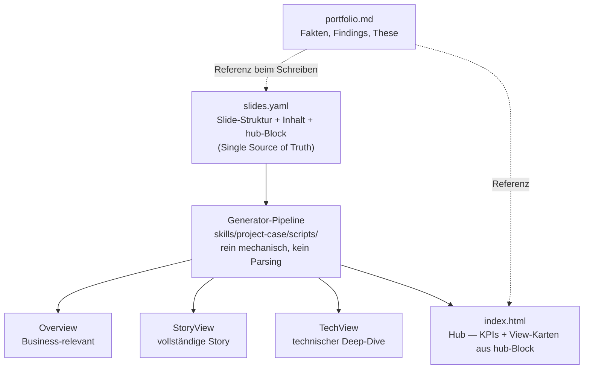

# Portfolio Pipeline — Dokumentation

> **Single Source of Truth für alle Portfolio-Artefakte**
>
> Diese Dokumentation erklärt die mechanisierte Portfolio-Pipeline:
> wie sie funktioniert, wie man sie nutzt, und wie man Probleme behebt.
>
> **Status:** 🟢 Operativ seit 2026-06-19
> **Erstellt:** 2026-06-19 von Claude Haiku 4.5

**Pfad-Konvention:** `SKILL_ROOT` = der Ordner dieser Datei selbst (`.../wgnd-skills/project-case/`).
Beim Lesen dieser Datei bereits bekannt — keine Herleitung nötig, kein Workspace-Bezug erforderlich.

---

## Überblick

**Update 2026-07-01:** Die ursprüngliche Annahme dieser Doku — `portfolio.md` steuert mechanisch die
Slide-Inhalte über `generate_json_from_portfolio.py` — hat sich als nicht zutreffend herausgestellt.
Das Script hat die `chapters`/`slides`-Struktur nie aus `portfolio.md` abgeleitet, sondern unverändert
aus `public/json-backup/` kopiert; die aus `portfolio.md` extrahierten Werte landeten nur in einem
ungenutzten `_extracted`-Feld. Die tatsächlichen Slide-Inhalte wurden über mehrere Sessions hinweg
direkt in den drei `storyline-*.json` von Hand editiert — unabhängig je View, ohne Aufzeichnung. Das
war die Ursache für Inhalts-Drift zwischen den Views (siehe zh-tram-flow `PROCESS_LOG.md`, 2026-07-01).

**Korrigierte Architektur:** Es gibt zwei getrennte Quellen mit unterschiedlichem Zweck —
`portfolio.md` für Fakten/Findings/These (Prosa, von `/project-case story` befüllt), und
**`public/md/slides.yaml`** als neue, einzige Quelle für Slide-**Struktur** (welche Slide existiert,
in welchem Kapitel, mit welchem Inhalt, für welche Views). Portfolio.md wird beim Verfassen einer
Slide als Faktenreferenz herangezogen, aber nicht mehr automatisch geparst.



Die Kästen D/E/F stehen hier für zh-tram-flow — `view_composition` in `slides.yaml` legt pro Projekt
fest, wie viele Views es gibt und wie sie heißen (kein fixer Wert, siehe unten). Kasten G (der Hub)
ist kein View, sondern die Landingpage — sie bezieht ihre KPIs und View-Karten aus `slides.yaml`s
`hub`-Block (Details in Abschnitt „generate_index_from_portfolio.py"), nicht mehr aus hartcodiertem
HTML. Das war bis 2026-07-01 doppelt gepflegt (Template + Slides), seitdem einfach.

Die Generator-Pipeline besteht konkret aus zwei Scripts (`generate_json_from_slides.py` →
`generate_html_from_json.py`), plus `convert_json_to_md.py` für Markdown-Exports,
`generate_index_from_portfolio.py` für den Hub, und `print_slide_matrix.py` für den Audit — Details
in Abschnitt „Build-Scripts" unten.

`public/md/portfolio.md` bleibt parallel bestehen — Quelle für Findings/Recommendations/These, die
beim Verfassen von `slides.yaml` als Referenz dienen, sowie Input für `generate_index_from_portfolio.py`
(Projekt-Metadaten: Name, Zeitraum, Dashboard-Link — die restlichen Hub-Inhalte kommen aus `slides.yaml`s `hub`-Block).

**Warum das wichtig ist:**
- 🎯 **Keine manuellen Syncs** mehr zwischen den 3 View-JSONs — eine Slide wird einmal geschrieben,
  `views: [...]` in `slides.yaml` bestimmt die Wiederverwendung
- 📝 **Zentrale Quelle für Struktur** — `slides.yaml`, nicht mehr 3 unabhängig gepflegte JSONs
- 🏠 **Hub ist kein Sonderfall mehr** — `index.html` bezieht KPIs + View-Karten aus demselben
  `slides.yaml`, nicht aus separat gepflegtem HTML (gefunden + gefixt 2026-07-01)
- 🔄 **Reproduzierbar** — beliebig oft regenerierbar, ohne Backup-Verzeichnis als Zwischenschritt
- ✅ **Nachvollziehbar** — Git-Historie auf `slides.yaml` zeigt jede inhaltliche Änderung

---

## Architektur

### 1. Fakten-Quelle: `public/md/portfolio.md`

Quelle für Findings/Recommendations/These/Problem-Statement. Wird von `/project-case story` befüllt
und dient als Referenz beim Verfassen von Slides — steuert aber **nicht mehr automatisch** deren
Struktur (das übernimmt `public/md/slides.yaml`, siehe 1b).

**Struktur:**
```markdown
# Portfolio Summary — Zurich Tram Flow

## Project
name:       Zurich Tram Flow
slug:       zh-tram-flow
type:       DANSC
...

## Storyline
thesis:     [Die Kernthese]
hook:       [Das Hook/Überraschungs-Statement]
proof:      [4-Schritt-Beweiskette]
so_what:    [Was folgt daraus]

## Problem
kpi_name:   OTP — On-Time Performance
kpi_ist:    87
kpi_soll:   95 %
kpi_gap:    −8 %
problem_statement: |
  [Das Problem ausführlich erklärt]

## Key Findings
### F1 — [Titel]
finding:    [Was wurde gefunden]
number:     [Die Zahl]
source:     [Notebook-Referenz]

### F2 — ...
...

## Model Results
algorithm:  [Algorithmus]
target:     [Target Variable]
metric:     [Metrik]

### Baseline Benchmark
| Model | Logic | Metric |
|:---|:---|:---|
| ...

### Model Progression
| Model | Features | Test MAE | vs. Baseline |
|:---|:---|:---|:---|
| ...

## Recommendations
r1:
  title:    [Titel]
  detail:   [Detaillierte Begründung]

r2: ...

## Research Opportunities
<!-- VIEWS: storyview, techview -->

[Nennung + Beispiele]

## Figures
```yaml
spatial:
  - ../img/...
temporal:
  - ../img/...
```

## Status
generated_by:    /portfolio story
generated_at:    [Datum]
summary_version: [Version]
```

**Konventionen:**
- **Deutsches Zahlenformat:** `18,56 s`, `87 %`, `r ≥ 0,85` (Komma, Leerzeichen vor Einheit)
- **Keine Typos:** Die Datei wird maschinell geparst
- **Quellen als Kommentare:** `<!-- Extracted from Notebook X -->` (optional)
- **View-Marker:** `<!-- VIEWS: overview, storyview, techview -->` (für Research Opportunities)

---

### 1b. Slide-Struktur: `public/md/slides.yaml`

**Die einzige Datei, die Slide-Inhalt und -Struktur bestimmt.** Ersetzt die frühere Annahme, dass
`generate_json_from_portfolio.py` das aus `portfolio.md` ableitet (tat es nie — siehe Hinweis oben).

**Struktur (Kurzform — siehe zh-tram-flow `public/md/slides.yaml` für das reale Beispiel):**
```yaml
chapters:
  - id: <kapitel-id>
    nav_label: <Kapitel-Name>
    slides:
      - id: <slide-id>
        views: [overview, storyview, techview]   # welche Views diese Slide zeigen
        role: standard   # oder title / closing / abbinder
        title: "..."
        subtitle: "..."
        content: [...]   # gleiche content-item-Typen wie im bisherigen JSON-Schema (figures, steps, ...)

view_composition:
  overview:  [<kapitel-id>, ...]   # Kapitel-Auswahl + Reihenfolge PRO View
  storyview: [<kapitel-id>, ...]
  techview:  [<kapitel-id>, ...]

view_meta:
  <view>: {project, period, author, github, presentation_title, audience, duration_minutes}
  # → landet unverändert im "meta"-Feld der jeweiligen storyline-{view}.json

hub:
  headline_kpis_from: <slide-id>   # Zeiger auf eine Slide — deren figures-Block wird Hero-KPI-Reihe im Hub
  view_order: [<view>, ...]        # Reihenfolge der Karten auf dem Hub
  view_cards:
    <view>: {kicker, label, description, badge, badge_class}   # steuert public/index.html
```

**`hub` ist Teil von `slides.yaml`, nicht optional** — `public/index.html` wird daraus generiert
(`generate_index_from_portfolio.py`, siehe Build-Scripts unten). Wer Slide-Inhalte ändert, die auch
auf dem Hub auftauchen (Kernzahlen, View-Beschreibungen), muss diesen Block mitpflegen.

**Kein `locked`-Feld** (frühere Idee, verworfen 2026-07-01): Schutz vor versehentlichem
Überschreiben passiert nicht pro Slide, sondern einmal am Anfang von Mode `slides` — bestehende
`slides.yaml` erkannt → Backup anbieten → Kay entscheidet "neu aufbauen" oder "weiterarbeiten".
Siehe `project-case.md`, Mode `slides`, Schritt 0.

**Kernprinzip:** eine Slide = ein Eintrag, einmal geschrieben. `views` bestimmt Wiederverwendung —
identischer Inhalt in mehreren Views ist damit strukturell garantiert, kein Copy-Paste-Drift mehr
möglich. `view_composition` erlaubt trotzdem, dass Views unterschiedliche Kapitel-Teilmengen und
-Reihenfolgen haben (z. B. TechView ohne "Data Engineering"-Kapitel).

**Anzahl Views ist projektspezifisch:** zh-tram-flow hat 3 Views (overview, storyview, techview) —
kein `socialview`. Wie viele Views ein Projekt hat, ergibt sich aus `view_composition`, nicht aus einer
fixen Zahl in dieser Doku (ältere Abschnitte unten, die von "4 Views inkl. socialview" sprechen,
beschreiben ein nie erreichtes Ziel, nicht den Ist-Zustand).

---

### 2. Build-Scripts

**Alle Scripts liegen im Skill** (`{SKILL_ROOT}/scripts/`),
nicht im Projekt — sie arbeiten ausschließlich relativ zum aktuellen Arbeitsverzeichnis
(`Path.cwd()`), also immer aus dem Projekt-Root heraus aufrufen:
```bash
SKILL_SCRIPTS={SKILL_ROOT}/scripts
```

#### `generate_json_from_slides.py`

**Input:** `public/md/slides.yaml`
**Output:** `public/json/storyline-{view}.json` — eine Datei pro View aus `view_composition`

**Was es tut (rein mechanisch, keine Interpretation):**
1. Liest `slides.yaml`
2. Für jede View in `view_composition`: Kapitel in der angegebenen Reihenfolge durchgehen
3. Pro Kapitel: nur die Slides übernehmen, deren `views`-Liste diese View enthält
4. Schreibt `public/json/storyline-{view}.json` im bestehenden JSON-Schema (unverändert für
   `generate_html_from_json.py` konsumierbar)

**Ausführung:**
```bash
uv run python $SKILL_SCRIPTS/generate_json_from_slides.py
```

---

#### `generate_html_from_json.py`

**Input:** `public/json/storyline-*.json`
**Output:** `public/{view}.html` — unverändert, konsumiert weiterhin generisch über `chapters`/`slides`/`content`

**Was es tut:**
1. Lädt jede JSON-Datei
2. Rendert sie als Reveal.js Präsentation
3. Nutzt `skills/project-case/templates/slides-template.html` (global, neben diesem Script)
4. Kopiert `skills/project-case/templates/slides.css` → `public/css/slides.css` (Build-Kopie,
   projektübergreifend identisches Design — siehe „Design-Templates sind Skill-eigen" unten)
5. Schreibt eine HTML-Datei pro View

**Ausführung:**
```bash
python3 $SKILL_SCRIPTS/generate_html_from_json.py
```

**Output:**
```
Loading template...
✅ Loaded template: /Users/.../slides-template.html

📊 Generating overview...
  → Loaded JSON
  → Built HTML presentation
✅ Wrote: public/overview.html

... (weitere Views laut view_composition)

✅ HTML generation complete!
```

---

#### `convert_json_to_md.py` (existierend)

**Input:** `public/json/storyline-*.json`
**Output:** `public/md/{view}.md` — eine Datei pro View

**Was es tut:**
1. Konvertiert JSON-Strukturen zu Markdown
2. Schreibt eine Markdown-Datei pro View
3. Kann für Gamma-Import oder andere Markdown-Tools genutzt werden

**Ausführung:**
```bash
python3 $SKILL_SCRIPTS/convert_json_to_md.py
```

---

#### `generate_index_from_portfolio.py`

**Input:** `public/md/portfolio.md` (Project-Block: Name, Zeitraum, Dashboard-URL) **und**
`public/md/slides.yaml` (Block `hub:` — siehe unten) + `skills/project-case/templates/index-template.html`
(Layout, global — seit 2026-07-01 nicht mehr im Projekt, reines Layout ohne Content)
**Output:** `public/index.html` (Hub)

**Was es tut:**
1. Liest `portfolio.md` für Name/Zeitraum/Dashboard-Link
2. Liest `slides.yaml` → Block `hub`:
   - `hub.headline_kpis_from`: Slide-ID, deren `figures`-Content-Block als Hero-KPI-Reihe gerendert wird
     (Zeiger, keine Kopie — die 4 KPIs oben im Hub sind immer exakt die dieser Slide)
   - `hub.view_order` + `hub.view_cards[view]` (`kicker`, `label`, `description`, `badge`, `badge_class`):
     rendert die 3 View-Karten
3. Ersetzt `{{...}}`-Platzhalter im Template (inkl. `{{HEADLINE_KPIS}}`, `{{VIEW_CARDS}}`)

**⚠️ Wichtig für jede künftige Slide-Autorenarbeit** (aktuell manuell, später `/project-case slides`-Modus):
`public/index.html` wird **nicht mehr unabhängig von den Slides gepflegt**. Wer `slides.yaml` ändert
— neue Kernzahlen, andere View-Beschreibung, geänderte Zielgruppe — muss auch den `hub`-Block
mitdenken:
- Ändert sich die von `headline_kpis_from` referenzierte Slide inhaltlich? → Hub ändert sich automatisch mit (kein Handeln nötig).
- Soll der Hub eine ANDERE Slide als KPI-Quelle nutzen? → `headline_kpis_from` anpassen.
- Ändert sich Titel/Beschreibung/Zielgruppe/Dauer einer View grundlegend? → `hub.view_cards[view]`
  entsprechend nachziehen, sonst zeigt der Hub veraltete Texte.
Das ist der Grund, warum dieser Wert überhaupt in `slides.yaml` und nicht mehr hart im Template steht
(gefunden 2026-07-01: identische KPIs standen doppelt in Template und Slides, sind bei einer Content-
Änderung nur an einer Stelle aktualisiert worden — genau das soll dieser Mechanismus verhindern).

**Ausführung:**
```bash
python3 $SKILL_SCRIPTS/generate_index_from_portfolio.py
```

---

### 3. `public/json-backup/` — retiriert

**Nicht mehr Teil der Pipeline.** Diente früher als "Referenz-Template", war aber faktisch die einzige
Quelle für Slide-Inhalte (siehe Hinweis oben) und selbst schon veraltet gegenüber den hand-editierten
`public/json/storyline-*.json`. Mit `slides.yaml` als einziger Quelle entfällt der ganze
"Template laden"-Schritt — es gibt kein Backup-Verzeichnis mehr, das die Pipeline braucht. Etwaige
noch vorhandene `public/json-backup/`-Dateien sind historisch und können gelöscht werden.

---

## Workflow: So benutzt man es

### Fall A: Kleine Textänderung (Zahl, Formulierung, eine Slide)

Direkt in `public/md/slides.yaml` editieren (und `portfolio.md`, falls sich die Faktenlage
geändert hat), dann die Pipeline mechanisch neu laufen lassen:

```bash
vim public/md/slides.yaml
make portfolio     # = archive → json → html → index → md → matrix, siehe Mode "report"
```

Kein Skill-Modus nötig für diesen Fall — direkte Datei-Edits + `make portfolio` reichen.

### Fall B: Neue `slides.yaml` bauen oder größere inhaltliche Überarbeitung

```bash
/project-case slides
```

Dialog-Modus (siehe Mode `slides` oben): fragt bei bestehender Datei erst nach Backup +
Neu-vs-Weiterarbeiten, baut dann StoryView zuerst mit Kapitel-für-Kapitel-Feedback, leitet
Overview/TechView per Wiederverwendung ab, zeigt vor dem Schreiben eine Tabelle zur Abnahme.

### Fall C: Komplette Pipeline von Grund auf (neues Projekt, oder alles neu aufsetzen)

```bash
/project-case full
```

Das tut: `check` → `story` → `slides` (Dialog, wartet auf Kay) → `report` (mechanisch) →
Git-Commit → PROCESS_LOG-Update.

**Validieren**

Die neuen Artefakte werden in `public/` geschrieben:
```bash
ls -la public/json/           # 1 JSON-File pro View
ls -la public/*.html          # 1 HTML-Präsentation pro View
ls -la public/md/*.md         # 1 Markdown-File pro View
```

**4. Committen (wenn nicht automatisch)**

```bash
git add public/json public/*.html public/md
git commit -m "feat: updated portfolio artifacts

- portfolio.md: updated [was geändert]
- Artefakte regeneriert aus pipeline

Co-Authored-By: Claude Haiku 4.5 <noreply@anthropic.com>"
```

---

## Validierungs-Checkliste

Nach jeder Änderung diese Punkte checken:

- [ ] **slides.yaml**
  - [ ] YAML-Syntax valide? (`python3 -c "import yaml; yaml.safe_load(open('public/md/slides.yaml'))"`)
  - [ ] Jede Slide hat `id`, `views`
  - [ ] `view_composition` enthält nur existierende Kapitel-IDs

- [ ] **portfolio.md**
  - [ ] Alle Zahlen mit korrektem Format? (`18,56 s`, `87 %`, etc.)
  - [ ] Keine Typos in Struktur (headings, sections)?
  - [ ] Quellen-Kommentare vorhanden (optional)?

- [ ] **JSON-Files**
  - [ ] Eine Datei pro View aus `view_composition` vorhanden?
  - [ ] Für jede Slide, die in mehreren Views auftaucht: identischer Inhalt? (`print_slide_matrix.py`
    zeigt das direkt)

- [ ] **HTML-Files**
  - [ ] Eine HTML-Datei pro View vorhanden?
  - [ ] Im Browser öffbar? (keine Fehler in Console)
  - [ ] Navigation funktioniert? (Links zwischen Slides)

- [ ] **Markdown-Files**
  - [ ] Eine MD-Datei pro View vorhanden?
  - [ ] Formatierung ok? (keine broken Markdown)
  - [ ] Zusammenhang zu Originalen korrekt?

- [ ] **index.html**
  - [ ] Landing Page aktualisiert? (neue KPIs, Beschreibung)
  - [ ] Links zu allen Views funktionieren?
  - [ ] Responsive am Handy?

---

## Troubleshooting

### Problem: Scripts funktionieren nicht

**Fehler: `ModuleNotFoundError: No module named 'json'`**

→ Python 3 nutzen:
```bash
python3 $SKILL_SCRIPTS/generate_json_from_slides.py
```

---

### Problem: JSON Generation fehlgeschlagen

**Fehler: `FileNotFoundError: public/md/slides.yaml nicht gefunden`**

→ Registry existiert noch nicht — muss einmalig angelegt werden (Content-Alignment-Session,
siehe zh-tram-flow `PROCESS_LOG.md` 2026-07-01 für den Ablauf). Es gibt kein Backup-Verzeichnis
mehr, aus dem sich das automatisch wiederherstellen ließe — `slides.yaml` ist die einzige Quelle.

**Fehler: YAML-Syntaxfehler beim Laden**

```bash
python3 -c "import yaml; yaml.safe_load(open('public/md/slides.yaml'))"
```
Zeigt Zeile + Fehlerursache (meist Einrückung oder fehlender Doppelpunkt).

---

### Problem: HTML sieht merkwürdig aus

**Symptoms:** Keine Styles, broken Layout, leere Seiten

→ Template-Pfad prüfen:
```bash
ls {SKILL_ROOT}/templates/slides-template.html
ls {SKILL_ROOT}/templates/slides.css
# Beide müssen existieren
```

Falls nicht: Fallback-Template wird genutzt (basic Reveal.js) bzw. `public/css/slides.css`
wird nicht aktualisiert (Warnung in der Konsole beim Lauf).

---

### Problem: Zahlenformat nicht konsistent

**Beispiel:** `18.6s` statt `18,56 s`

→ Beide Quellen checken — Slide-Text lebt in `slides.yaml`, Fakten/Findings in `portfolio.md`:
```bash
grep -n "\.[0-9].*s" public/md/slides.yaml public/md/portfolio.md
```

Sollte zeigen: KEINE Treffer (alle Dezimal-Kommata verwenden).

Korrektur: manuelle Suche-Replace in der jeweiligen Datei (`18.56 s` → `18,56 s`, `87%` → `87 %`),
danach `generate_json_from_slides.py` + `generate_html_from_json.py` erneut ausführen.

---

### Problem: Scripts laufen langsam

**Symptom:** `generate_json_from_slides.py` dauert > 10 Sekunden

→ Normal für große Registries. Wenn extrem (>60s):
```bash
wc -l public/md/slides.yaml
```

---

## Häufig gestellte Fragen

### F: Kann ich die HTMLs manuell editieren?

**A:** Nicht empfohlen! Sie werden beim nächsten `/project-case full` überschrieben.

Besser: Änderungen in `slides.yaml` machen (Slide-Inhalt) bzw. `portfolio.md` (Fakten) →
Pipeline regeneriert alles.

---

### F: Wo speichert die Pipeline Metadaten?

**A:** Es gibt kein `_extracted`-Feld mehr (war ungenutzt totes Gepäck aus der alten Architektur).
Findings/Recommendations/These stehen in `public/md/portfolio.md`, Slide-Zuordnung + Inhalt in
`public/md/slides.yaml`. Beide sind Klartext (Markdown/YAML) — kein `jq` nötig, direkt lesbar.

---

### F: Kann ich neue Views hinzufügen?

**A:** Ja! Workflow:

1. In `public/md/slides.yaml` unter `view_composition` einen neuen Key hinzufügen
   (z. B. `socialview: [einstieg, erkenntnis, empfehlungen]`)
2. Pro Slide, die in der neuen View auftauchen soll: `views`-Liste um den neuen Namen erweitern
3. `generate_json_from_slides.py` ausführen — braucht **keine Code-Änderung**, liest
   `view_composition` generisch
4. `/project-case full` ausführen

---

### F: Woher kommen die KPI-Zahlen im index.html?

**A:** Manuell in `public/index.html` eingetragen (nicht aus pipeline).

Wenn Zahlen ändern → `index.html` direkt editieren oder `/project-case full` neu ausführen.

---

## Backup & Recovery

### Falls etwas schiefgeht

Es gibt kein separates Backup-Verzeichnis mehr — `slides.yaml` ist die einzige Quelle, Git ist der
Wiederherstellungsmechanismus:

```bash
# Letzten funktionierenden Stand von slides.yaml wiederherstellen
git log --oneline public/md/slides.yaml
git checkout <commit> -- public/md/slides.yaml

# Danach Pipeline neu laufen lassen
uv run python $SKILL_SCRIPTS/generate_json_from_slides.py
uv run python $SKILL_SCRIPTS/generate_html_from_json.py
```

`archive_portfolio_artifacts.py` (im Skill) snapshotet zusätzlich vor jedem `/project-case report`-Lauf
nach `public/archive/vN/` (gitignored, für schnellen visuellen Vergleich ohne Git-Historie durchsuchen
zu müssen).

---

## Deployment

### GitHub Pages (automatisch)

Die `public/` Ordner wird automatisch zu GitHub Pages deployed:

```
main branch
    ↓
public/ Ordner
    ↓
GitHub Pages
    ↓
https://kaywiegand.github.io/zh-tram-flow/
```

**Nach einem Commit:**
```bash
git push origin main
# → GitHub Actions deployed automatisch
# → index.html ist live unter https://...
```

---

## Technische Details

### Warum kein Regex-Parsing von portfolio.md mehr

Die alte Architektur nutzte Regex-Pattern, um `portfolio.md` in JSON-Slides zu übersetzen
(`pattern = r"### F(\d+) — (.+?)\n\`\`\`\nfinding:\s*(.+?)\n..."`). Das ist fragil bei jeder
Formatabweichung und kann keine Entscheidungen treffen (welches Finding wird welche Slide, in
welchem Kapitel, für welche Views) — das ist Urteilsarbeit, keine Mustererkennung. Ergebnis in der
Praxis: das Script hat nie wirklich Slide-Inhalte erzeugt, sie wurden stattdessen direkt in den
JSON-Dateien von Hand gepflegt, ohne dass das irgendwo dokumentiert war.

`generate_json_from_slides.py` parst nichts mehr — es liest die bereits fertig strukturierte
`slides.yaml` (Urteilsarbeit ist beim Schreiben der Registry schon passiert, per
Content-Alignment-Session mit dem Projekt-Owner) und filtert/ordnet nur noch mechanisch.

---

### `slides.yaml` → JSON-Struktur

`generate_json_from_slides.py` erzeugt pro View eine Datei in genau dem Schema, das
`generate_html_from_json.py` schon immer erwartet hat — daran ändert sich nichts:

```json
{
  "meta": {
    "presentation_title": "...",
    "audience": "...",
    "duration_minutes": 10
  },
  "chapters": [
    {
      "nav_label": "Einstieg",
      "slides": [
        {
          "role": "title",      // oder "standard"
          "title": "...",
          "subtitle": "...",
          "content": [
            {
              "type": "figures",  // oder "agenda", "sections", etc.
              "items": [...]
            }
          ]
        }
      ]
    }
  ]
}
```

Kein `_extracted`-Feld mehr — das war in der alten Architektur ungenutzt (`generate_html_from_json.py`
liest es nie), also dead weight.

---

## Erweiterungen (Zukunft)

Mögliche Verbesserungen:

- [ ] **Automatische Validierung** — CI/CD prüft portfolio.md Format
- [ ] **Spell-Check** — deutsche Rechtschreibung validieren
- [ ] **Zahlen-Validierung** — Zahlen müssen aus Notebooks stammen
- [ ] **PDF-Export** — Portfolio auch als PDF
- [ ] **Analytics** — Track welche View am meisten gelesen wird
- [ ] **Versionierung** — Archive aller portfolio-Versionen

---

## Support & Kontakt

**Bei Problemen:**

1. **Lokale Tests:** Scripts manuell ausführen und Output checken
2. **Git-History:** `git log public/md/slides.yaml` zeigt was geändert wurde
3. **Archiv:** `public/archive/vN/` (gitignored, Snapshot vor jedem `report`-Lauf) als schneller
   visueller Vergleich
4. **Documentation:** Dieses File und CLAUDE.md

---

## Changelog

### 2026-07-02 — Konsolidierung: Skill-Referenzdateien doch komplett in skills/project-case/

Revidiert gegenüber dem Eintrag direkt darunter ("Bewusst nicht verschoben"). Die dortige Annahme,
`STANDARD.md`/`CHECKLIST.md`/`WORKFLOW.md` würden von `project-case` UND `project-review` genutzt,
hielt einer Grep-Verifikation nicht stand:

- ❌ Korrigiert: `CHECKLIST.md` und `WORKFLOW.md` wurden von `project-review.md` an keiner einzigen
  Stelle referenziert — nur von `project-case.md`. Nie geteilt, exklusiv `project-case`.
- ✅ `STANDARD.md` → `case-standards.md`: umbenannt (Name beschrieb nicht was drin ist), Leseebenen +
  Personas entfernt (echte Dopplung mit `communication-concept.md`, das feiner granular dieselbe
  Frage beantwortet), Persona-Spalten aus den verbleibenden Tabellen entfernt, `Pflicht-Artefakte` +
  `Datei-Existenz` (waren dieselbe Liste zweimal) zusammengeführt, `reports/` → `public/` korrigiert
- ✅ `CHECKLIST.md` → `portfolio-check-template.md` (Name = was die Datei nach dem Kopieren wird)
- ✅ `WORKFLOW.md` → `preparation-workflow.md` (Abgrenzung zu `build-pipeline.md`: einer ist der
  menschliche Vorbereitungs-Fahrplan vor dem Skill, der andere die technische Innenansicht des Skills)
- ✅ `COMMUNICATION_CONCEPT.md` → `communication-concept.md`: `project-review.md`s einzige Erwähnung
  war ein loses Zitat ohne funktionale Abhängigkeit — de facto auch exklusiv `project-case`, trotzdem
  hier belassen statt nach `project-review/` verschoben, da inhaltlich zu `project-case`s Storytelling
  gehört, nicht zu `project-review`s Audit
- ✅ `portfolio_summary_template.md` → `portfolio-summary-template.md` (nur Schreibweise, kebab-case
  durchgängig)
- ✅ `README_template.md` → `../project-review/portfolio-readme-template.md`: einzige exklusiv
  `project-review`-Datei, dorthin verschoben statt nach `project-case/`
- ✅ Diese Datei: `PORTFOLIO_PIPELINE.md` → `build-pipeline.md` (Abgrenzung s.o.)
- Gefunden + entschieden in einer Workspace-Session zur Vorbereitung der `wgnd-skills`-Repo-Extraktion

---

### 2026-07-01 (weitere Fortsetzung) — Design-Templates auch zum Skill: alle Portfolios sehen gleich aus

Revidiert gegenüber dem Eintrag direkt darunter: Kay wollte explizit, dass **alles, was der
Skill braucht, um sein Ergebnis zu bauen, beim Skill liegt** — nicht nur Mechanik, auch Design.
Auslöser: `styleguide.html` (damals noch in `docs/portfolio/templates/`) hatte im Kopf-Kommentar
stehen, ihr CSS-Block sei eine "VERBATIM-Kopie von `zh-tram-flow/public/css/slides.css`" — die
kanonische Design-Quelle lag also versehentlich in einem einzelnen Projekt, nicht global.

- ✅ `slides-template.html`, `styleguide.html`: `docs/portfolio/templates/` → `skills/project-case/templates/`
- ✅ `index-template.html`: `zh-tram-flow/scripts/` → `skills/project-case/templates/` (Revision der
  Entscheidung von vorhin — siehe Eintrag direkt darunter)
- ✅ **Neu:** `skills/project-case/templates/slides.css` als kanonische Quelle — vorher gab es die
  nur projektlokal in `zh-tram-flow/public/css/slides.css`
- ✅ `generate_html_from_json.py` kopiert `slides.css` jetzt bei jedem Lauf aus dem Skill ins Projekt
  (`public/css/slides.css` wird zur reinen Build-Kopie, nie mehr von Hand editieren)
- ✅ `styleguide.html` bindet `slides.css` jetzt per echtem `<link>` ein statt es hand-kopiert
  vorzuhalten — behebt die Duplikation, die der alte Kopf-Kommentar dokumentierte
- ✅ `.claude/launch.json` (Preview-Server "styleguide") auf neuen Pfad aktualisiert

**Bewusst nicht verschoben:** `README_template.md`, `portfolio_summary_template.md`,
`STANDARD.md`, `CHECKLIST.md`, `WORKFLOW.md` — bleiben in `docs/portfolio/`, da sie von
mehreren Skills genutzt werden (`project-case` UND `project-review`), nicht exklusiv von
`project-case`.

*(Siehe Korrektur im Eintrag ganz oben, 2026-07-02 — diese Annahme stimmte nur für `STANDARD.md`,
nicht für `CHECKLIST.md`/`WORKFLOW.md`.)*

---

### 2026-07-01 (Fortsetzung) — Scripts verschoben: projektlokal → Skill

Nachdem sich `slides.yaml` in zh-tram-flow bewährt hatte, direkt am selben Tag zum Skill
verschoben (statt wie ursprünglich geplant erst nach einer zweiten Session/Projekt zu warten):

- ✅ Alle 6 generischen Scripts (`archive_portfolio_artifacts.py`, `generate_json_from_slides.py`,
  `generate_html_from_json.py`, `generate_index_from_portfolio.py`, `convert_json_to_md.py`,
  `print_slide_matrix.py`) von `zh-tram-flow/scripts/` nach `skills/project-case/scripts/` verschoben
- ✅ Voraussetzung geschaffen: 3 Scripts nutzten `Path(__file__).parent.parent` (nur korrekt,
  solange das Script im Projekt selbst liegt) — auf `Path.cwd()` umgestellt.
  `convert_json_to_md.py` hatte sogar einen hartcodierten absoluten Pfad zu `zh-tram-flow` — ebenfalls gefixt
- ✅ Hartcodierte View-Liste (`["overview","storyview","techview"]`) in `generate_html_from_json.py`
  und `convert_json_to_md.py` durch dynamische Erkennung aus vorhandenen `storyline-*.json`
  ersetzt — funktioniert jetzt auch in Projekten mit anderer `view_composition`
- ✅ `index-template.html` bewusst **nicht** verschoben — kuratierter Projekt-Content
  (wie `slides.yaml`), kein generisches Script
- ✅ `Makefile` in zh-tram-flow zeigt jetzt über `SKILL_SCRIPTS`-Variable auf den Skill-Pfad
- Grund: einmal sauber dokumentiert, für Kay (dieses Mermaid-Diagramm, s. u.) und für künftige
  Claude-Sessions (einheitliche Skill-MD-Files statt Projekt-verstreuter Doku)

---

### 2026-07-01 — Architektur-Korrektur: slides.yaml ersetzt json-backup

- ❌ Korrigiert: `portfolio.md` hat nie mechanisch die Slide-Struktur gesteuert — 
  `generate_json_from_portfolio.py` kopierte `chapters` unverändert aus `public/json-backup/`,
  Findings landeten nur in einem ungenutzten `_extracted`-Feld
- ✅ `public/md/slides.yaml` als neue, einzige Quelle für Slide-Struktur + -Inhalt eingeführt
  (`id`, `views`, `view_composition` je Slide/Kapitel)
- ✅ `generate_json_from_slides.py` ersetzt `generate_json_from_portfolio.py` — rein mechanisch
  (Filter + Reihenfolge), kein Regex-Parsing mehr
- ✅ `public/json-backup/` retiriert
- ✅ `print_slide_matrix.py` neu — Audit-Tabelle (Slide × View), wiederholt ausführbar
- ✅ `public/mds/` → `public/md/` Pfad-Bug in `project-case.md` (Modi `check`/`story`) gefixt
- Gefunden + entschieden im Rahmen einer zh-tram-flow-Session (Details: dortiges `PROCESS_LOG.md`)

---

### 2026-06-19 — Initial Release

- ✅ portfolio.md als Single Source of Truth etabliert
- ✅ generate_json_from_portfolio.py geschrieben
- ✅ generate_html_from_json.py geschrieben
- ✅ convert_json_to_md.py verifiziert
- ✅ index.html (Landing Page) erstellt
- ✅ Komplette Dokumentation geschrieben
- ✅ Pipeline mit `/project-case full` integriert

**Status:** 🟢 Production Ready

---

**Generated with ❤️ by Claude Haiku 4.5**
**Skill-Ordner (Scripts + diese Doku):** `{SKILL_ROOT}`
**Erstprojekt (Referenz für das Schema):** `zh-tram-flow` (im Workspace des Autors)
